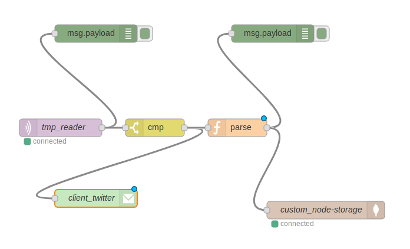
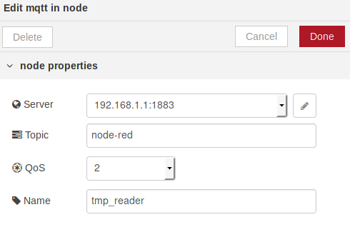
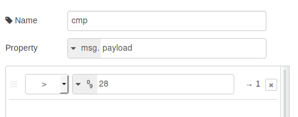
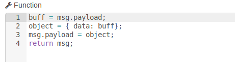
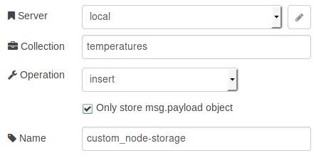

# node-red-example

## Alumnos
Sergio Semedi Barranco

Lucas Segarra Fernández


### Memoria

Para la realización de esta práctica hemos realizado el siguiente proyecto:

Arquitectura:

Host <-- MV(node-red:1880, mqtt-broker:1883) <--> ci40 (mqtt-pub:1883) <-temperature-sensor
            twitter^gmail

Para desarrollar el sistema hemos decidido lanzar node-red sobre la maquina virtual,
esta accede a la ci40 mediante ethernet (192.168.1.0/24).
La ci40 leerá datos sobre el sensor de temperatura gracias a el código desarrollado
para la primera práctica de esta asignatura, una vez obtenido el dato procederá a su
publicación mediante MQTT a el broker(MV) mediante el topic 'node-red'.

La maquina virtual estara corriendo node-red, este tendrá un nodo(mqtt) subscrito
a ese mismo broker y topic node-red, una vez recibido el mensaje se comparará con
un valor y en caso de ser mayor a cierta temperatura se enviará un mensaje de correo
para alertar al usuario y se procedera a almacenar la temperatura en una basa de datos
no relacional mongodb.


Screenshots:

Arquitectura de flujo (node-red): Figura 1


Lector de temperatura (mqtt): Figura 2


comparador: Figura 3
 Figura 4

formateo del payload(parse): Figura 4


almacenamiento(storage): Figura 5



```javascript
    JSON OUTPUT =
    [
        {
            "id": "1f47e6a3.8cfff9",
            "type": "tab",
            "label": "Flow 1"
        },
        {
            "id": "bc630e63.5e7858",
            "type": "twitter-credentials",
            "z": "",
            "screen_name": "@SergioSemedi"
        },
        {
            "id": "9585bfa4.2c8bd8",
            "type": "mqtt-broker",
            "z": "",
            "broker": "192.168.1.1",
            "port": "1883",
            "clientid": "",
            "usetls": false,
            "compatmode": true,
            "keepalive": "60",
            "cleansession": true,
            "willTopic": "",
            "willQos": "0",
            "willPayload": "",
            "birthTopic": "",
            "birthQos": "0",
            "birthPayload": ""
        },
        {
            "id": "b0463c6.a9bb5c",
            "type": "mongodb",
            "z": "",
            "hostname": "127.0.0.1",
            "port": "27017",
            "db": "temperature",
            "name": "local"
        },
        {
            "id": "5d9d7520.2ea5b4",
            "type": "mqtt in",
            "z": "1f47e6a3.8cfff9",
            "name": "tmp_reader",
            "topic": "node-red",
            "qos": "2",
            "broker": "9585bfa4.2c8bd8",
            "x": 130,
            "y": 300,
            "wires": [
                [
                    "1035e2bf.a382f5",
                    "86410c39.a6d75"
                ]
            ]
        },
        {
            "id": "1035e2bf.a382f5",
            "type": "debug",
            "z": "1f47e6a3.8cfff9",
            "name": "",
            "active": true,
            "console": "false",
            "complete": "payload",
            "x": 190,
            "y": 140,
            "wires": []
        },
        {
            "id": "39551250.753856",
            "type": "e-mail",
            "z": "1f47e6a3.8cfff9",
            "server": "smtp.gmail.com",
            "port": "465",
            "secure": true,
            "name": "ssemedi@ucm.es",
            "dname": "client_twitter",
            "x": 190,
            "y": 420,
            "wires": []
        },
        {
            "id": "86410c39.a6d75",
            "type": "switch",
            "z": "1f47e6a3.8cfff9",
            "name": "cmp",
            "property": "payload",
            "propertyType": "msg",
            "rules": [
                {
                    "t": "gt",
                    "v": "28",
                    "vt": "num"
                }
            ],
            "checkall": "true",
            "outputs": 1,
            "x": 290,
            "y": 300,
            "wires": [
                [
                    "39551250.753856",
                    "4e7591a2.84d188"
                ]
            ]
        },
        {
            "id": "733ee916.abc168",
            "type": "mongodb out",
            "z": "1f47e6a3.8cfff9",
            "mongodb": "b0463c6.a9bb5c",
            "name": "custom_node-storage",
            "collection": "temperatures",
            "payonly": true,
            "upsert": false,
            "multi": false,
            "operation": "insert",
            "x": 580,
            "y": 440,
            "wires": []
        },
        {
            "id": "4e7591a2.84d188",
            "type": "function",
            "z": "1f47e6a3.8cfff9",
            "name": "parse",
            "func": "buff = msg.payload;\nobject = { data: buff};\nmsg.payload = object;\nreturn msg;",
            "outputs": 1,
            "noerr": 0,
            "x": 430,
            "y": 300,
            "wires": [
                [
                    "8d3cdfec.9fdf38",
                    "733ee916.abc168"
                ]
            ]
        },
        {
            "id": "8d3cdfec.9fdf38",
            "type": "debug",
            "z": "1f47e6a3.8cfff9",
            "name": "",
            "active": true,
            "console": "false",
            "complete": "payload",
            "x": 490,
            "y": 140,
            "wires": []
        }
    ]
```
